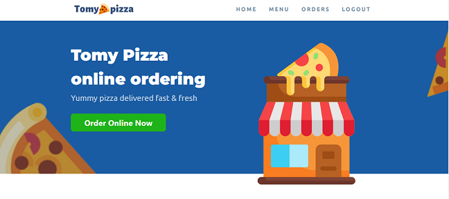

# Pizza-app
<h3>
  Order your favourite pizza from Tommy 
  
  Pizza
</h3>

  

<h1>Frameworks and Languages Used</h1>
<ul>
    <li>
        HTML, CSS and Javacript
    </li>
    <li>
        Express
    </li>
    <li>Mongoose</li>
    <li>EJS</li>
    <li>Passport</li>
</ul>
<h1>Deployment</h1>

Web App deployment: https://order-tommy-pizza.herokuapp.com/

